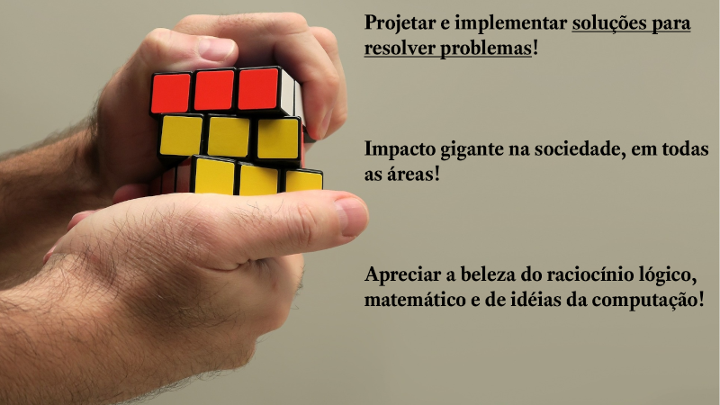
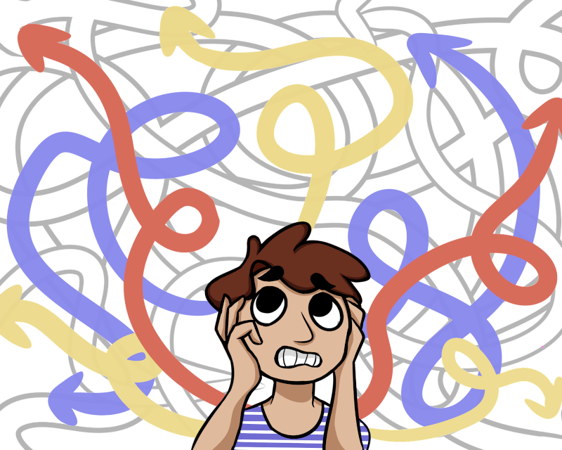
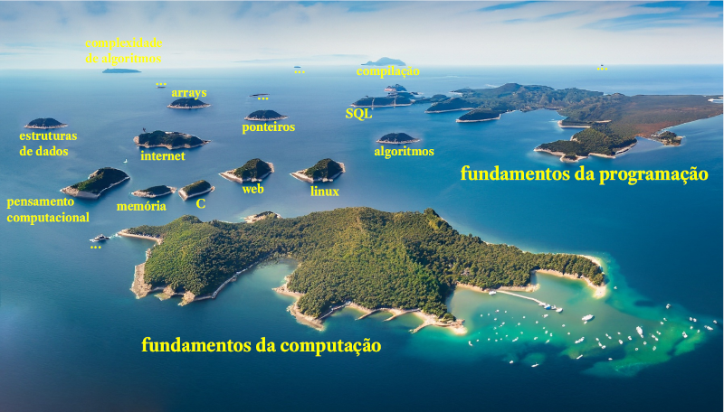
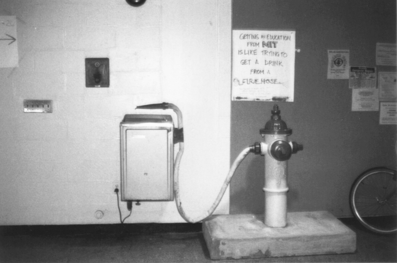
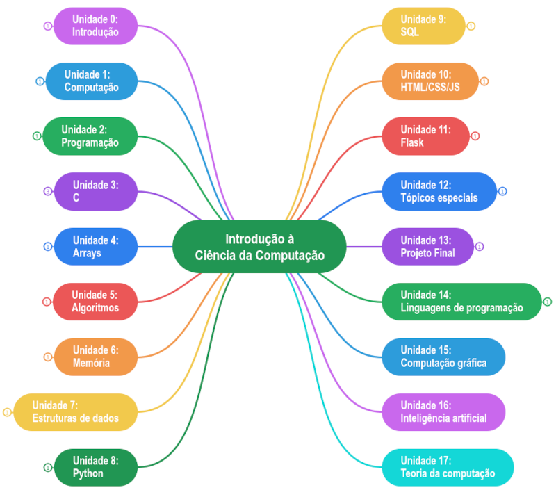
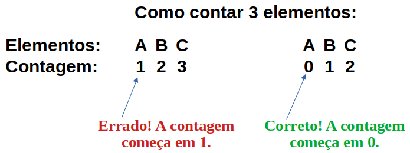

# <i class="fa-regular fa-book-open-reader"></i> Unidade 0: introdução à CR6.100B

Nesta unidade faremos uma introdução geral à CR6.100B e discutiremos coisas
como: visão geral da disciplina, quais seus objetivos, o que esperamos que você
aprenda, quais as unidades de aprendizagem, métodos de avaliação e muitas outras
informações úteis para que seu aproveitamento seja maximizado.

Sumário:
* [Vídeo da aula](#vídeo-da-aula)
- Material de referência nesta página:
    * [Por que você está aqui?](#por-que-você-está-aqui)
    * [Computação não é sobre computadores ou
      programação](#computação-não-é-sobre-computadores-ou-programação)
    * [O "arquipélago" da computação: visão geral da
      disciplina](#o-arquipélago-da-computação-visão-geral-da-disciplina) 
    * [Não desista, é muita coisa mas você
      conseguirá!](#não-desista-é-muita-coisa-mas-você-conseguirá)
    * [Como saber se você está indo bem ou
      mal?](#como-saber-se-você-está-indo-bem-ou-mal)
    * [Construção e dinâmica da CR6.100B](#construção-e-dinâmica-da-cr6100b)
    * [Unidades de estudo](#unidades-de-estudo)
* Diário de Aprendizagem (em breve)

## Vídeo da aula

<i class="fa-light fa-download"></i> <i class="fa-light fa-file-pdf"></i>
[Download dos slides do vídeo](unidade_0.pdf)

## Por que você está aqui?
Antes de prosseguir na leitura, gostaria de propor um exercício: pare e reflita,
durante alguns segundos ou minutos, sobre o **motivo de você estar aqui, fazendo
essa disciplina**. Idealmente você deveria escrever essa resposta em um pedaço
de papel ou em um caderno que você tenha separado para a disciplina mas, no
mínimo, faça essa breve reflexão.

Você está aqui por curiosidade em computação? Por que gosta de jogos online?
Você já tem algum objetivo mais concreto (quer ser programador web ou
programador de aplicativos)? Ou tem um grande objetivo financeiro, aprender
computação para mudar de vida?

Independentemente do motivo que te trouxe para esta disciplina, se você quer
seguir na área da ciência da computação, deve estar ciente de que:


Ciência da computação é sobre **projetar e implementar soluções para resolver
problemas** importantes em diversas áreas do conhecimento humano.


O cientista da computação utiliza ferramentas computacionais para projetar
soluções para diversos tipos de problemas em praticamente todas as áreas:
finanças, educação, comunicação, tecnologia, matemática, ciências, engenharia,
ciências humanas, ciências sociais, artes...

O potencial e o impacto benéfico que a computação pode exercer na sociedade é
gigante. Tente pensar em alguma área que não utiliza computação: provavelmente
você terá dificuldade de encontrar um único exemplo.

Você também aprenderá a apreciar a beleza do raciocínio lógico, matemática e de
idéias da computação, pois são a base para o projeto de nossas soluções.

## Computação não é sobre computadores ou programação
Se você é como qualquer outra pessoa que está iniciando agora seus estudos sobre
ciência da computação, as chances são de que você provavelmente pensa que
computação é sobre computadores, ou que computação é sobre programação. Na
verdade a coisa não é bem assim:


Ciência da computação não é sobre computadores e não é sobre programação.


[Hal Abelson](https://en.wikipedia.org/wiki/Hal_Abelson), um dos autores do
soberbo livro **Structure and Interpretation of Computer Programs**
([SICP](https://web.mit.edu/6.001/6.037/sicp.pdf)), em uma de suas aulas explica
que:

> [A ciência da computação] Também não se trata muito de computadores. E não se
> trata de computadores no mesmo sentido em que a física não se trata realmente
> de aceleradores de partículas, e a biologia não se trata realmente de
> microscópios e placas de Petri. E não se trata de computadores no mesmo
> sentido em que a geometria não se trata realmente do uso de instrumentos
> topográficos.
>
> Na verdade, há muitos pontos em comum entre a ciência da
> computação e a geometria. A geometria, antes de mais nada, é outra disciplina
> com um péssimo nome. O nome vem de Gaia, que significa Terra, e metron, que
> significa medir. Geometria originalmente significava medir a Terra ou fazer
> levantamentos. E a razão para isso foi que, há milhares de anos, o sacerdócio
> egípcio desenvolveu os rudimentos da geometria para descobrir como restaurar
> os limites dos campos que foram destruídos nas cheias anuais do Nilo. E para
> os egípcios que fizeram isso, a geometria era realmente o uso de instrumentos
> topográficos.
>
> Agora, a razão pela qual pensamos que a ciência da computação
> trata de computadores é praticamente a mesma razão pela qual os egípcios
> pensavam que a geometria tratava de instrumentos de levantamento. E isto é,
> quando alguma área está apenas começando e você não a entende muito bem, é
> muito fácil confundir a essência do que você está fazendo com as ferramentas
> que você usa. E, de facto, numa escala absoluta de coisas, provavelmente
> sabemos menos sobre a essência da ciência da computação do que os antigos
> egípcios realmente sabiam sobre geometria.
>
> Bem, o que quero dizer com essência da ciência da computação? O que quero
> dizer com essência da geometria? Veja, é certamente verdade que esses egípcios
> usaram instrumentos de topografia, mas quando olhamos para eles depois de
> alguns milhares de anos, dizemos, caramba, o que eles estavam fazendo, a coisa
> importante que estavam fazendo, era começar a formalizar noções sobre espaço e
> tempo, para iniciar uma maneira de falar formalmente sobre verdades
> matemáticas. Isso levou ao método axiomático. Isso levou a que toda a
> matemática moderna descobrisse uma maneira de falar precisamente sobre o
> chamado conhecimento declarativo, o que é verdadeiro.
>
> Bem, da mesma forma, acho que no futuro as pessoas olharão para
> trás e dirão, sim, aqueles primitivos do século 20 estavam brincando com esses
> dispositivos chamados computadores, mas na verdade o que eles estavam fazendo
> era começando a aprender como formalizar intuições sobre processos, como fazer
> as coisas, começando a desenvolver uma forma de falar precisamente sobre o
> conhecimento do como fazer, em oposição à geometria que fala sobre o que é
> verdadeiro.

Em resumo, ciência da computação, em sua essência, não é sobre computadores:
estes são apenas os instrumentos que utilizamos (que programamos) para obter a
resposta à problemas. **A essência da ciência da computação (que será vista em
mais detalhes na próxima unidade) é formular, de modo preciso, "receitas" que
nos permitem resolver diversos tipos de problemas**. Por isso o cientista da
computação não é apenas um programador: os computadores (e a programação que
comanda os computadores) são apenas os instrumentos utilizados.

Considere a figura abaixo. Ela é uma analogia que ilustra uma pessoa "perdida",
que não consegue encontrar a solução para um problema. Nessa figura há várias
propostas de soluções que não levam a lugar nenhum (os caminhos em branco) e há
propostas de soluções que aparentemente ajudam a resolver o problema (caminhos
em azul, amarelo e vermelho). O trabalho da cientista da computação é ajudar na
descoberta da melhor solução, ou da melhor solução possível, dentre todas as
opções.

Para que você aprenda a resolver problemas de como computacional, a CR6.100B
terá 4 grandes focos:

* Fundamentos da computação
* Fundamentos da programação
* Visão atual
* Visão futura

Dentro desses 4 grandes focos, abordaremos diversos tópicos, ou áreas, da
computação, tais como (não se preocupe se você não souber o que esses tópicos
significam):

* Pensamento computacional
* Abstração, algoritmos, recursão
* Estruturas de dados, funções como dados
* Representação de dados
* Bancos de dados e SQL
* Programação C
* Programação Python
* Programação Web (HTML + CSS + JavaScript; Flask)
* Complexidade de algoritmos
* ... (e muito mais)

## O "arquipélago" da computação: visão geral da disciplina
Para que você entenda melhor quais são os conteúdos a serem estudados na
CR6.100B, considere a figura abaixo, que ilustra um arquipélago onde cada ilha
representa uma área da computação.

Agora imagine que você está em um dos barcos na imagem, fazendo um passeio por
todas as ilhas desse arquipélago. Essa é uma boa analogia de nossa disciplina:
faremos uma viagem por diversas "ilhas de conhecimento" da ciência da
computação.

Nossa primeira parada será na ilha dos **fundamentos da computação**. Aqui
faremos uma grande exploração dos alicerces fundamentais da computação para que
você ganhe uma base sólida a partir da qual possa entender os demais
conteúdos. Junto com os fundamentos da computação visitaremos também a "ilha" de
pensamento computacional.

Depois visitaremos a ilha dos **fundamentos da programação**. Aqui você começará
a perceber a diferença entre computação e programação, e aprenderá os construtos
fundamentais da programação e algumas linguagens.

As ilhas que representam esse conhecimento fundamental são as maiores ilhas do
arquipélago, pois são a base do seu aprendizado. Estudaremos em detalhes esses
fundamentos.

Depois visitaremos diversas outras "ilhas" da computação: algoritmos, Linux,
programação web, linguagem C, arrays, estruturas de dados, memória, ponteiros,
processo de compilação, SQL, JavaScript e outras coisas. Em resumo, faremos um
"passeio", uma "viagem", por diversas áreas da ciência da computação.

Note que não faremos uma exploração detalhada em algumas dessas "ilhas",
ficaremos apenas "na praia". Isso porque o assunto é muito complexo para uma
exploração profunda em uma disciplina introdutória e, durante o curso de
ciência da computação, você terá disciplinas específicas para aprender esses
assuntos. Mas mesmo nesses assuntos que não exploraremos em detalhes você será
capaz de aprender e entender o básico para continuar seus estudos posteriores.

## Não desista, é muita coisa mas você conseguirá!
Sim, o conteúdo da disciplina é muito grande e desafiador. Uma imagem que
ilustra muito bem a quantidade de conteúdo a ser estudado é o _hack_ que alguns
estudantes do [Massachusetts Institute of Technology (MIT)](https://www.mit.edu)
fizeram , concretizando uma famosa citação de [Jerome
Wiesner](https://libraries.mit.edu/mithistory/institute/offices/office-of-the-mit-president/jerome-bert-wiesner-1915-1994/),
um antigo presidente do instituto:

> _Getting an education from MIT is like taking a drink from a Fire Hose_ (em
> tradução livre: "Estudar no MIT é como beber água de uma mangueira de
> incêndio").

Essa analogia reflete muito bem a realidade: você terá que estudar muita coisa e
em muito pouco tempo. Você terá que estudar o máximo e tentar aproveitar o
máximo possível. Será difícil? Sim. Você precisará de disciplina e de algumas
características e atitudes para conseguir. Em especial:

* **Coragem**: você precisa de coragem para encarar o desafio, você precisa ser
  capaz de dar o "salto inicial" e começar a estudar. Se você está lendo este
  texto, meus parabéns!, você já deu o primeiro passo.
* **Resiliência**: você precisa ser capaz de enfrentar dificuldades, por muitas
  horas ou dias, até conseguir alcançar os objetivos de uma determinada unidade
  de estudo, de uma tarefa de programação ou de resolução de um problema
  computacional. Talvez você até pense em desistir algumas vezes. Não se
  preocupe, isso é normal. O que você precisa ter é resiliência para enfrentar
  as dificuldades e persistir até conseguir.
* **Estudo**: prepare-se para estudar, e muito! Tanto teoria quanto prática. Não
  se aprende ciência da computação somente assistindo vídeos na Internet. Você
  tem que colocar a "mão na massa". Em especial prepare-se para fazer:
    * Os _**Diários de Aprendizagem**_: são questões discursivas que você deve
      imprimir e responder (por escrito!) para fazer uma auto-avaliação. Essa
      auto-avaliação irá mostrar o que você entendeu e o que você não entendeu
      sobre a matéria. É **extremamente importante** que você faça os Diários de
      Aprendizagem, e faça **por escrito**. Um erro comum que os estudantes
      cometem é apenas pensar nas respostas. Não faça isso! Os Diários de
      Aprendizagem foram projetados para que você imprima e responda por
      escrito, para praticar análise e síntese de conteúdo.
    * Diversas _**Tarefas de Resolução de Problemas**_: você deve **pensar** na
      solução e no problema, antes de colocar a mão no teclado para
      **programar**. Se você começar a resolver um problema colocando a mão no
      teclado para programar, você já está errando. Lembre-se: computação não é
      programação. Você vai usar a programação para implementar uma solução que
      você já pensou e projetou previamente. Simplesmente não adianta começar a
      digitar código sem pensar previamente.
    * Muitas _**Leituras**_: você terá que ler os **slides** e o conteúdo no
      **site da CR6.100B**. A princípio não será necessário nenhum outro livro
      adicional, mas algumas indicações serão feitas no site e nas aulas para os
      alunos que quiserem estudar em maior profundidade.
* **Sair de sua zona de conforto**: para conseguir progredir você deve estar
  preparado para realmente sair de sua zona de conforto e encarar problemas para
  os quais você não está preparado inicialmente.

Se você se dedicar tenha certeza: quando você conseguir resolver um problema
difícil terá um momento "Eureka!", você sentirá um sentimento de conquista e
satisfação pessoal indescritível. Essas conquistas farão que você se sinta cada
vez mais confiante para buscar maiores desafios.

Mesmo que você nunca tenha estudado nada de ciência da computação anteriormente,
saiba que você não está sozinho: segundo dados da Harvard CS50, cerca de 2/3 dos
alunos nunca tinham estudado nada relativo à computação anteriormente.

## Como saber se você está indo bem ou mal?
Além das notas das tarefas de programação, ao final do curso **não importa tanto
onde você está em relação aos seus colegas, mas onde você chegou em relação a
onde estava no começo**.

Lembre-se de que se você conseguir cumprir todas as tarefas de programação
receberá diretamente da Universidade de Harvard um certificado oficial de
conclusão da disciplina (da CS50).

## Construção e dinâmica da CR6.100B
Durante a elaboração desta disciplina as seguintes decisões foram tomadas:

* A base de tudo é a [Harvard CS50](https://cs50.harvard.edu/x);
* Alguns tópicos da disciplina [The Beauty and Joy of
  Computing](https://bjc.berkeley.edu), da Universidade da Califórnia, em
  Berkeley, foram aproveitados;
* Alguns tópicos da disciplina [Berkeley CS10](https://cs10.org), também da
  Universidade da Califórnia, em Berkeley, foram aproveitados;
* Alguns tópicos da disciplina [MIT
  6.001](https://ocw.mit.edu/courses/6-001-structure-and-interpretation-of-computer-programs-spring-2005/)
  e da disciplina [MIT
  6.0001](https://ocw.mit.edu/courses/6-0001-introduction-to-computer-science-and-programming-in-python-fall-2016/)
  foram aproveitados; e
* Alguma coisa de minha própria experiência também foi acrescentada.

A dinâmica do curso será a seguinte:

* Se você está acompanhando por conta própria, na Internet, você deve assistir
  às aulas gravadas, fazer os diários de aprendizagem (auto-avaliação) e enviar
  as tarefas de programação para correção automatizada pelos autograders da
  Harvard CS50; e
* Se você é meu aluno presencial, deverá fazer tudo que os alunos por conta
  própria na Internet fazem e, além disso, enviar alguns exercícios adicionais
  no Autolab do Computação Raiz, e fazer alguns testes e provas no ambiente de
  e-Learning do Computação Raiz.

## Unidades de estudo
O mapa mental abaixo mostra todas as 18 unidades de estudo da disciplina (as
unidades de 0 a 13 correspondem ao conteúdo que foi adaptado da CS50, e as
unidade 14 a 17 foram acrescentadas):

Esta é a **Unidade 0: Introdução à CR6.100B**. Você pode estar curioso sobre o
motivo da numeração das unidades começar no zero. A partir de agora decore e
repita a regra abaixo como um mantra:


**Todo cientista da computação começa a contar a partir do número 0 (zero)**.

  

Isso é muito importante. Se temos $$n$$ elementos, o cientista da computação
conta de $$0$$ até $$n-1$$ (e não de $$1$$ até $$n$$). Começar a contar a partir
do zero tem grandes vantagens durante a programação. No momento basta você
aprender e praticar essa regra mas, se você tiver curiosidade e quiser saber
mais um pouco, recomento o manuscrito EWD831 de [Edsger Wybe
Kijkstra](https://en.wikipedia.org/wiki/Edsger_W._Dijkstra), intitulado [_Why
numbering should start at
zero_](https://www.cs.utexas.edu/users/EWD/ewd08xx/EWD831.PDF).


Em resumo, as demais unidades de aprendizagem são:

* **Unidade 1: Fundamentos da Computação**. Vamos entender como os cientistas da
  computação resolvem problemas, e como eles pensam (pensamento computacional).
* **Unidade 2: Fundamentos da Programação**. Vamos aprender os fundamentos da
  programação utilizando linguagens visuais de programação.
  ([Scrath](https://scratch.mit.edu/) e [Snap!](https://snap.berkeley.edu/)).
* **Unidade 3: Linguagem C**. Vamos converter os fundamentos da programação que
  aprendemos utilizando linguagens visuais, para uma linguagem textual e
  consolidada de programação, a [linguagem
  C](https://en.wikipedia.org/wiki/C_(programming_language)), criada em 1970 por
  [Dennis Ritchie](https://en.wikipedia.org/wiki/Dennis_Ritchie).
* **Unidade 4: Arrays**. Vamos aprender sobre compilação, debugging, memória,
  arrays e strings.
* **Unidade 5: Algoritmos**. Vamos aprender a como criar algoritmos para
  resolver problemas computacionais clássicos (ordenação, busca). Também
  falaremos sobre complexidade de algoritmos e recursão.
* **Unidade 6: Memória**. Vamos aprender em detalhes a arquitetura da memória do
  computador para podermos entender sobre ponteiros e alocação dinâmica de
  variáveis.
* **Unidade 7: Estruturas de Dados**. Vamos aprender sobre estruturas para
  armazenamento de dados complexos.
* **Unidade 8: Linguagem Python**. Vamos migrar da linguagem C para uma
  linguagem mais moderna, a linguagem
  [Python](https://en.wikipedia.org/wiki/Python_(programming_language)), criada
  em 1991 por [Guido van
  Rossum](https://en.wikipedia.org/wiki/Guido_van_Rossum).
* **Unidade 9: Bancos de dados e SQL**. Vamos trabalhar com sistemas de
  gerenciamento de bancos de dados e a linguagem
  [SQL](https://en.wikipedia.org/wiki/SQL), que é utilizada para fazer
  inserções, atualizações e consultas de dados em bancos de dados.
* **Unidade 10: Programação Web (HTML, CSS e JS)**. Aprenderemos como a
  linguagem de marcação [HTML](https://en.wikipedia.org/wiki/HTML) funciona, o
  que é e como trabalhar com [CSS](https://en.wikipedia.org/wiki/CSS), bem como
  a utilizar a linguagem de programação
  [JavaScript](https://en.wikipedia.org/wiki/JavaScript).
* **Unidade 11: Flask**. Aprenderemos a utilização de _frameworks_ e bibliotecas
  que nos permitirão construir aplicações web rapidamente. Em especial
  utilizaremos o [Flask](https://en.wikipedia.org/wiki/Flask_(web_framework)).
* **Unidade 12: Tópicos Especiais**. Vamos aprender sobre alguns tópicos e
  ferramentas que serão úteis em seu projeto final.
* **Unidade 13: Projeto Final**. Aqui você escolherá um problema de sua escolha
  e projetará e implementará uma solução, do início ao fim!
* **Unidade 14: Linguagens de Programação**. Uma visão geral sobre os principais
  paradigmas de linguagens de programação e as principais linguagens de cada
  um. Vamos implementar o mesmo algoritmo em diversos paradigmas de programação.
* **Unidade 15: Computação Gráfica**. Uma visão geral sobre computação gráfica.
* **Unidade 16: Inteligência Artificial**. O que é inteligência artificial? Como
  isso funciona? Quais os impactos da inteligência artificial em nossas vidas?
* **Unidade 17: Teoria da Computação**. Faremos um estudo introdutório nas
  questões mais "filosóficas" e "teóricas" da computação.
* **Unidade $$\infty$$**: Você verá que só começamos a "arranhar" a superfície
  de muitos conteúdos na computação mas, mesmo assim, você já está preparado e
  com base suficiente para seguir por conta própria.

