# <i class="fa-solid fa-microchip"></i> Unidade 1: computação

Nesta unidade começaremos nosso estudo sobre computação e, mais especificamente,
sobre ciência da computação. Nosso objetivo é fazer com que você entenda os
grandes fundamentos da computação, incluindo:

* O que é ciência da computação
* Representação de dados no computador
* Algoritmos
* Pensamento computacional
* Abstração

O conteúdo desta unidade está dividido em 6 partes, sendo a primeira parte uma
visão geral do que estudaremos. Em cada parte você encontrará o vídeo da aula, o
texto correspondente e demais recursos. Utilize o sumário abaixo para navegar no
conteúdo da unidade.

**Sumário:**
- PARTE 0: [visão geral da unidade](#parte-0-visão-geral-da-unidade)
    * [Vídeo da parte 0](#parte-0-visão-geral-da-unidade)
- PARTE 1: [o que é ciência da
  computação?](#parte-1-o-que-é-ciência-da-computação)
    * [Vídeo da parte 1](#vídeo-da-parte-1-o-que-é-ciência-da-computação)
    * [Essência e conceito da ciência da
      computação](#essência-e-conceito-da-ciência-da-computação)
    * [Modelo geral da computação](#modelo-geral-da-computação)
    * [Conhecimento declarativo e
      imperativo](#conhecimento-declarativo-e-imperativo)
- PARTE 2: [representação de dados](#parte-2-representação-de-dados)
    * [Vídeo da parte 2](#vídeo-da-parte-2-representação-de-dados)
    * [Por que é importante entender a representação de
      dados?](#por-que-é-importante-entender-a-representação-de-dados)
    - [Representação de números](#representação-de-números)
      * [Noção intuitiva dos sistemas
        numéricos](#noção-intuitiva-dos-sistemas-numéricos)
      * [Por que os computadores "falam"
        binário?](#por-que-os-computadores-falam-binário)
      * [Formalização dos sistemas
        numéricos](#formalização-dos-sistemas-numéricos)
        * [Sistema decimal](#sistema-decimal)
        * [Sistema binário](#sistema-binário)
        * [Sistema octal](#sistema-octal)
        * [Sistema hexadecimal](#sistema-hexadecimal)
        * [Generalização para outros
          sistemas](#generalização-para-outros-sistemas)
      * [Unidades de medida decimal](#unidades-de-medida-decimal)
      * [Unidades de medida binária](#unidades-de-medida-binária)
      * [Comparação entre medidas decimais e
        binárias](#comparação-entre-medidas-decimais-e-binárias)
    - [Representação de textos](#representação-de-textos)
      * [ASCII: American Standard Code for Information
        Interchange](#ascii-american-standard-code-for-information-interchange)
      * [Unicode](#unicode)
    - [Anexo: conteúdo adicional sobre representação de
      números](#anexo-conteúdo-adicional-sobre-representação-de-números)
      * [Transformações entre sistemas
          numéricos](#transformações-entre-sistemas-numéricos)
      * [Representação de números inteiros negativos em
          binário](#representação-de-números-inteiros-negativos-em-binário)
      * [Representação de números fracionários em
          binário](#representação-de-números-fracionários-em-binário)
* [Diário de Aprendizagem](diario_unidade_0.pdf)

## PARTE 0: visão geral da unidade

<i class="fa-light fa-download"></i> <i class="fa-light fa-file-pdf"></i>
[Download dos slides do vídeo](unidade1_parte0.pdf)

Esta unidade compreende o estudo dos **fundamentos da computação** e dará a base
a partir da qual você aprenderá os pilares da computação e formará uma fundação
para as próximas unidades. Se você ainda não terminou as atividades da [Unidade
0: introdução](/unidades/0/), é importante que você não prossiga: estude
primeiro a Unidade 0 (incluindo fazer o diário de aprendizagem) e, depois,
continue aqui na Unidade 1.

Nesta Unidade 1 falaremos sobre os grandes fundamentos da computação, incluindo
discussões sobre: a) o que é ciência da computação; b) representação de dados em
um computador; c) algoritmos; d) pensamento computacional; e, por último, e)
abstração. A abstração, na verdade, é um dos componentes do pensamento
computacional mas, de tão importante, merece uma discussão detalhada em
separado. Este é o conteúdo desta unidade:

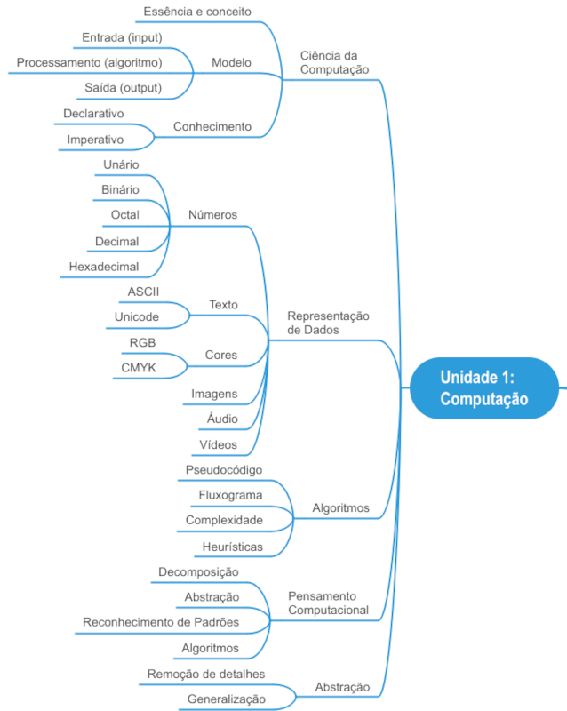

## PARTE 1: o que é ciência da computação?
### Vídeo da parte 1: o que é ciência da computação?

<i class="fa-light fa-download"></i> <i class="fa-light fa-file-pdf"></i>
[Download dos slides do vídeo](unidade1_parte1.pdf)

### Essência e conceito da ciência da computação
Existe uma certa confusão sobre o que é realmente a ciência da
computação. Muitas pessoas acreditam que computação é praticamente um sinônimo
de programação. Esse entendimento não é correto: a programação nos permite
expressar idéias e resolver problemas através de computadores mas a **essência**
da ciência da computação não depende de programação.


Ciência da computação **NÃO É** sobre programação.


Outras pessoas acreditam que ciência da computação é o trabalho com
computadores. Mas essa visão também não é correta: os computadores são meras
ferramentas de trabalho, são ferramentas fantásticas que programamos para nos
ajudar a resolver problemas de forma mais rápida, mas a **essência** da ciência
da computação também não depende de computadores (na verdade, alguns dos mais
antigos e fundamentais desenvolvimentos teóricos da computação ocorreu entre
1920 e 1940, muitos anos antes do desenvolvimento dos primeiros computadores).


Ciência da computação **NÃO DEPENDE** de computadores.


Alguns pensam que ciência da computação é o estudo dos usos e aplicações dos
computadores e softwares. Essa visão também não é correta: saber usar um
computador ou um software específico não é a essência da ciência da computação,
da mesma forma que saber dirigir um carro não é a essência da engenharia
automotiva.


Ciência da computação **NÃO É** sobre o uso de computadores e softwares.


Computadores, programação e o uso e a aplicação de softwares fazem parte do
"mundo" da computação mas não formam, isoladamente ou em conjunto, a essência da
ciência da computação.

Na realidade a ciência da computação é sobre **resolver problemas** de um certo
modo, de uma certa maneira. Mas como formalizar então qual é a **essência** da
ciência da computação? Talvez uma das melhores explicações sobre a essência da
ciência da computação foi dada por [Hal
Abelson](https://en.wikipedia.org/wiki/Hal_Abelson), um dos autores do soberbo
livro **Structure and Interpretation of Computer Programs**
([SICP: HTML
original](https://mitp-content-server.mit.edu/books/content/sectbyfn/books_pres_0/6515/sicp.zip/index.html);
[SICP: HTML novo](https://sarabander.github.io/sicp/); [SICP:
PDF](https://media.githubusercontent.com/media/sarabander/sicp-pdf/master/sicp.pdf);
[SICP: Texinfo](https://www.neilvandyke.org/sicp-texi/); [SICP: PDF da versão
JS](https://sicp.sourceacademy.org/sicpjs.pdf); [SICP: Comparison
Edition](https://sicp.sourceacademy.org/)), em uma aula para funcionários da
Hewlett-Packard, em julho de 1986. Abelson explica o que é a ciência da
computação do seguinte modo:

> [A ciência da computação] Também não se trata muito de computadores. E não se
> trata de computadores no mesmo sentido em que a física não se trata realmente
> de aceleradores de partículas, e a biologia não se trata realmente de
> microscópios e placas de Petri. E não se trata de computadores no mesmo
> sentido em que a geometria não se trata realmente do uso de instrumentos
> topográficos.
>
> Na verdade, há muitos pontos em comum entre a ciência da computação e a
> geometria. A geometria, antes de mais nada, é outra disciplina com um péssimo
> nome. O nome vem de Gaia, que significa Terra, e metron, que significa
> medir. Geometria, originalmente, significava medir a Terra ou fazer
> levantamentos. E a razão para isso foi que, há milhares de anos, o sacerdócio
> egípcio desenvolveu os rudimentos da geometria para descobrir como restaurar
> os limites dos campos que foram destruídos pelas cheias anuais do Nilo. E,
> para os egípcios que fizeram isso, a geometria era realmente o uso de
> instrumentos topográficos.
> Agora, a razão pela qual pensamos que a ciência da computação trata de
> computadores é praticamente a mesma razão pela qual os egípcios pensavam que a
> geometria tratava de instrumentos de levantamento. E isto é, quando alguma
> área está apenas começando e você não a entende muito bem, é muito fácil
> confundir a essência do que você está fazendo com as ferramentas que você
> usa. E, de fato, numa escala absoluta de coisas, provavemente sabemos menos
> sobre a essência da ciência da computação do que os antigos egípcios realmente
> sabiam sobre geometria.
>
> Bem, o que eu quero dizer com essência da ciência da computação? O que quero
> dizer com essência da geometria? Veja, é certamente verdade que esses egípcios
> usavam instrumentos de topografia, mas quando olhamos para eles depois de
> alguns milhares de anos, dizemos, caramba!, o que eles estavam fazendo, a
> coisa importante que estavam fazendo [a essência da geometria], era começar a
> formalizar noções sobre espaço e tempo, para iniciar uma maneira de falar
> formalmente sobre verdades matemáticas. Isso levou ao método axiomático. Isso
> levou a que toda matemática moderna descobrisse uma maneira de falar
> precisamente sobre o chamado conhecimento declarativo, sobre o que é
> verdadeiro.
>
> Bem, da mesma forma, acho que no futuro as pessoas olharão para trás e dirão,
> sim, aqueles primitivos do século 20 estavam brincando com esses dispositivos
> chamados computadores mas, na verdade, o que eles estavam fazendo era
> começando a aprender como formalizar intuições sobre processos, sobre como
> fazer as coisas, começando a desenvolver uma forma de falar precisamente sobre
> o conhecimento de como fazer alguma coisa [conhecimento imperativo], em
> oposição à geometria que fala sobre o que é verdadeiro [conhecimento
> declarativo].

Quando achamos que ciência da computação é sobre programação e computadores,
estamos confundindo a **essência da computação** com as **ferramentas** que são
utilizadas (os computadores). Quando uma nova área de estudo está sendo
desenvolvida é fácil confundir a essência com as ferramentas, e é essa confusão
que nos faz achar que ciência da computação é sobre computadores (a ciência da
computação é muito nova). Na verdade a essência da ciência da computação é
formalizar "receitas de bolo" (chamadas de **algoritmos**) que nos permitem
saber **como fazer as coisas**, sobre **como resolver problemas**. Em resumo,
podemos dizer que:


**CIÊNCIA DA COMPUTAÇÃO É A CIÊNCIA QUE ESTUDA, CRIA E IMPLEMENTA ALGORITMOS
PARA SOLUCIONAR PROBLEMAS.**


Nós estudaremos em detalhes o que é um algoritmo na Parte 3 desta unidade. Por
ora basta entender que um algoritmo é como se fosse uma "receita de bolo" que
seguimos para resolver um determinado problema, para realizar um determinado
processo. A palavra **algoritmo** (bem como a palavra **algarismo**) foi criada
a partir do nome de um matemático persa que viveu entre os séculos VIII e IX
(c. 780 - c. 850) chamado de **Abū Abd Allāh Muḥammad ibn Mūsā al-Khwārizmī**
(Pai de Abdullah, Mohammed, filho de Moisés, nativo de Khwarizm). Al-Khwārizmī
foi um gênio matemático à época, e seus trabalhos introduziram os numerais
hindu-arábicos e os conceitos de álgebra na matemática ocidental. Alguns de seus
trabalhos descreviam um modo sistemático de obter soluções para equações
quadráticas, ou seja, uma "receita" a ser seguida. A foto abaixo é uma estátua
em sua homenagem, na cidade de Khiva, atual Uzbequistão:

### Modelo geral da computação
Quando falamos que a ciência da computação resolve problemas, uma pergunta óbvia
é: **como** a computação resolve os problemas? Na verdade existe um "modelo
geral" através do qual a computação resolve problemas. Esse modelo de computação
pode ser ilustrado na figura abaixo:

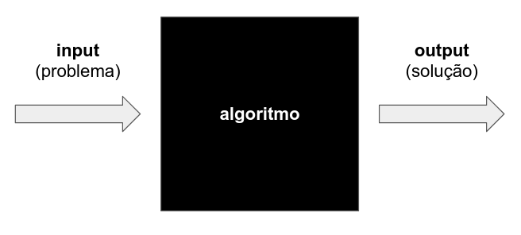

A partir de um determinado **problema**, fazemos o **input** (entrada) do
problema no computador. Esse problema será tratado por um **algoritmo** (a
"receita" para a solução do problema) e o computador fará o **output** (saída)
da solução. Esse modelo é muito importante: toda vez que você pretende resolver
um problema de forma computacional, você deve pensar e se fazer as seguintes
perguntas?

0. Qual é o **input** (entrada), ou seja, qual é o problema que eu quero
   resolver?
0. Qual é o **output** (saída), ou seja, qual é a solução esperada do problema?
0. E, por fim, que **algoritmo** me permite processar a entrada (o problema) e
   obter a saída correta (a solução)?

Atenção: não subestime a segunda pergunta, a solução esperada para o
problema. Muitas pessoas tendem a se focar somente no problema e não têm uma
visão clara de qual deve ser a solução correta, a solução esperada para o
problema. Se você não tem clareza em qual deveria ser a solução correta, é mais
difícil encontrar um algoritmo. Como você vai achar um algoritmo para
transformar o input no output, se você não sabe em que output quer chegar?

### Conhecimento declarativo e imperativo
Vamos voltar agora ao texto do Hal Abelson (acima). Note que ele nos diz que a
ciência da computação diz respeito a saber **como fazer** as coisas, em oposição
à saber **o que é** alguma coisa. Aqui existe uma distinção importante entre
dois "tipos" diferentes de conhecimento: o conhecimento **declarativo** e o
conhecimento **imperativo**. Para a ciência da computação, o conhecimento
imperativo é fundamental. Vamos entender melhor a diferença entre esses dois
"tipos" de conhecimento.


O conhecimento **declarativo** nos diz o que é verdadeiro, nos diz o que é
alguma coisa, define alguma coisa.


O conhecimento declarativo é a formalização da verdade, é o que é alguma
coisa. Por exemplo, eu quero calcular a raiz quadrada de $$33$$, ou seja, eu
quero calcular $$\sqrt{33}$$. Bom, a primeira coisa que eu preciso saber é **o
que é a raiz quadrada de um número**. A matemática nos diz exatamente o que é a
raiz quadrada:


$$\sqrt{x} = y\ |\ y \ge 0 \wedge y^2 = x$$


ou seja, a raiz quadrada de um número $$x$$ é o número $$y$$ tal que $$y$$ seja
maior ou igual a zero e que $$y^2$$ seja igual ao número $$x$$. Esse tipo de
conhecimento nos diz exatamente **o que é** a raiz quadrada, nos diz a
verdade. Mas não nos diz como calcular uma raiz quadrada. Ele é o "ponto de
partida", é a base a partir da qual podemos resolver um problema mas, por si só,
o conhecimento declarativo não nos diz como resolver o problema. E é aqui que
precisamos do conhecimento imperativo.


O conhecimento **imperativo** nos diz como fazer alguma coisa.


No caso do cálculo da $$\sqrt{33}$$, por exemplo, podemos utilizar o Método de
Newton, que diz o seguinte:


0. Chute um valor para $$y$$;
0. Calcule o valor de $$y^2$$;
0. Se $$y^2 = x$$, ou um valor próximo o suficiente, você achou a raiz. Termine
   o procedimento.
0. Se $$y^2 \ne x$$, ou não está próximo o suficiente, melhore a estimativa de
   $$y$$ fazendo o seguinte cálculo: novo $$y = \cfrac{y + \cfrac{x}{y}}{2}$$;
0. Retorne ao segundo passo até que você encontre a raiz ou uma aproximação
   suficiente.

   
Se seguirmos o algoritmo do Método de Newton e fizermos os cálculos manualmente,
acharemos que $$\sqrt{33} \approx 5.7445626$$.

Percebe-se então claramente a diferença entre o conhecimento declarativo e o
conhecimento imperativo:

* O conhecimento declarativo nos diz o que é alguma coisa (por exemplo, nos diz
  o que é uma raiz quadrada); e
* O conhecimento imperativo nos diz como fazer alguma coisa (por exemplo, como
  calcular a raiz quadrada de um número).

Perceba que, a partir do momento em que conseguimos estabelecer um algoritmo,
uma série de passos não ambíguos, bem ordenados, que terminam em um tempo hábil,
conseguimos achar a solução para o problema de forma "mecânica", basta apenas
seguir o algoritmo. Esta é a essência da ciência da computação: criar esses
algoritmos, essas "receitas" precisas que nos mostram como resolver um
problema.

Outro exemplo para entender a diferença entre conhecimento declarativo e
conhecimento imperativo: qual é o máximo divisor comum entre $$82$$ e $$44$$? A
primeira coisa que precisamos saber é **o que é** o máximo divisor comum entre
dois números. A matemática nos diz precisamente que (conhecimento declarativo):


"O máximo divisor comum ($$\text{mdc}$$) entre dois números $$a$$ e $$b$$,
$$\text{mdc}(a, b)$$, é o maior número $$x$$ que seja divisor ao mesmo tempo de
$$a$$ e $$b$$, ou seja, $$\text{rem}(a/x) = 0\ \wedge \text{rem}(b/x) = 0$$,
onde: $$a, b \in \mathbb{Z}$$ (ambos não podem ser $$0$$ ao mesmo tempo), $$x
\in \mathbb{Z}^*_+$$, $$\text{rem}$$ significa o resto do divisão, e
$$\text{mdc}(a, 0) = \text{mdc}(0, a) = |a|$$."


Sem entrar em muitos detalhes na matemática da coisa, a definição acima nos diz
que o máximo divisor comum é o maior número que divide os outros dois. Isso é
conhecimento declarativo, é o tipo de conhecimento que nos diz o que é alguma
coisa. E como calcular então o máximo divisor comum entre dois números? Para
isso precisamos de uma "receita", de um algoritmo, então precisamos do
conhecimento imperativo, o conhecimento de como fazer alguma coisa.

Para calcular o máximo divisor comum entre $$82$$ e $$44$$ usaremos o Método de
Euclides (conhecimento imperativo):


0. Inicie com $$\text{mdc}(a, b)$$;
0. Substitua $$\text{mdc}(a, b)$$ por $$\text{mdc}(b, \text{rem}(a/b))$$;
0. Continue substituindo até que apareça $$\text{mdc}(x, 0)$$;
0. Nesse momento $$\text{mdc}(a, b) = \vert x \vert$$.


Se seguirmos o Método de Euclides veremos que $$\text{mdc}(82, 44) = 2$$.

## PARTE 2: representação de dados
### Vídeo da parte 2: representação de dados

O vídeo abaixo tem 4 horas de duração. Talvez seja mais interessante você
assistir o vídeo [diretamente no
YouTube](https://www.youtube.com/watch?v=8T_hJhYg4R0){:target="\_blank"}, pois
na descrição do vídeo há um sumário detalhado com 69 tópicos cujos links abrem
as partes específicas do vídeo. Aqui está um resumo dos tempos do vídeo e os
grandes temas tratados:

* 0:00:00 - Introdução
* 0:17:12 - Representação de números
* 1:59:14 - Representação de textos
* 2:43:02 - Representação de cores
* 2:53:49 - Representação de imagens
* 3:24:30 - Representação de áudio
* 3:39:30 - Representação de vídeo
* 3:52:24 - Diferenciação das representações
* 3:56:00 - Finalização




<i class="fa-light fa-download"></i> <i class="fa-light fa-file-pdf"></i>
[Download dos slides do vídeo](unidade1_parte2.pdf)

### Por que é importante entender a representação de dados?
Para fazer a entrada dos dados em um computador, precisamos estudar como é feita
a representação dos diversos tipos de dados em um computador. Em nosso dia a dia
utilizamos algarismos decimais (0, 1, 2, 3, 4, 5, 6, 7, 8 e 9), letras (de A até
Z), sinais matemáticos (+, -) e diversos outros símbolos que nos permitem
trabalhar com dados diversos mas, nos computadores, não temos toda essa
liberdade. Então, de que forma podemos representar dados? Essa parte mostrará em
detalhes a representação de números, textos, cores, imagens, áudio e vídeo:

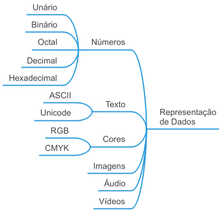

E por que é importante entender a representação de dados? Pensando no modelo
geral de computação que estudamos na Parte 1 desta unidade, temos que fazer a
entrada (*input*) dos dados em um computador, que processará esses dados através
de um algoritmo, e a saída (*output*) apresentada pelo computador será a solução
de nosso problema.

A pergunta óbvia aqui então é: "como fazer a entrada dos
dados no computador?" Não basta apenas dizer "pelo teclado". Nós precisamos
entender em detalhes **como** os dados são representados pois, dependendo da
representação que utilizarmos, podemos ter **maior ou menor flexibilidade e
facilidade na resolução dos problemas**. Também não somos obrigados a utilizar a
mesma representação no *input* e no *output* e, assim, temos que ser capazes de
escolher a melhor representação possível para cada caso.

Para que a importância da representação do problema fique mais clara, imagine o
seguinte: temos um problema simples para resolver, fazer a contagem de objetivos
utilizando os dedos de uma mão. Nós podemos escolher representar essa contagem
através do **Sistema Unário**, que contém apenas um único algarismo, o
$$1$$. Utilizando essa representação para os dados, quantos objetos podemos
contar com os dedos de uma única mão? Obviamente $$5$$ objetos. É possível
contar mais do que cinco objetos com uma mão? Se continuarmos representando a
contagem de objetos com o sistema unário, não. Mas, se mudarmos a representação
da contagem dos objetos, podemos aumentar nossa capacidade de contagem! Se
utilizarmos o **Sistema Binário**, que contém dois algarismos, o $$0$$ e o
$$1$$, quantos objetos podemos contar com os dedos de uma mão?
Surpreendentemente podemos contar $$32$$ objetos, do objeto número $$0$$ até o
objeto número $$31$$. Percebe por que a representação dos dados é importante? Se
eu **encontrar uma representação melhor para os dados**, eu tenho maior
flexibilidade, mais capacidade e facilidade de resolver problemas.


Saber qual é a melhor representação de dados para cada problema é fundamental na
ciência da computação. Na maioria das vezes é mais fácil achar uma representação
melhor do que tentar criar um algoritmo complexo para uma representação ruim.


Como curiosidade, se utilizarmos o sistema binário, quantos objetos podemos
contar utilizando duas mãos (dez dedos)? Por incrível que pareça, podemos contar
$$1024$$ objetos, do objeto número $$0$$ até o objeto número $$1023$$. Compare
isso com o sistema unário:

* Representar a contagem com o sistema unário: $$10$$ objetos
* Representar a contagem com o sistema binário: $$1024$$ objetos

Só de alterarmos a representação dos dados tivemos um ganho de $$10.140\%$$ em
nossa capacidade de contagem! Em resumo:


Ao encontrarmos uma representação mais adequada para os dados de nosso problema:

* Podemos fazer mais com menos
* Podemos utilizar algoritmos mais simples e adequados
* Temos maior flexibilidade na entrada e na saída
* Melhoramos nossa capacidade de resolução de problemas


### Representação de números
#### Noção intuitiva dos sistemas numéricos
O **Sistema Unário** é aquele que só tem um único algarismo, o
$$1$$. Infelizmente, para nossos propósitos, é um sistema muito limitado e, por
isso, praticamente não é utilizado na computação e não será mais nosso objeto de
estudo.

Já o **Sistema Binário**, que possui dois algarismos, o $$0$$ e o $$1$$, é o
sistema mais importante na computação pois os computadores somente "falam a
linguagem binária". Mas como esse sistema funciona? Intuitivamente o sistema
binário funciona como se fosse o hodômetro de um carro. Como funciona o
hodômetro de um carro? Veja a figura abaixo:

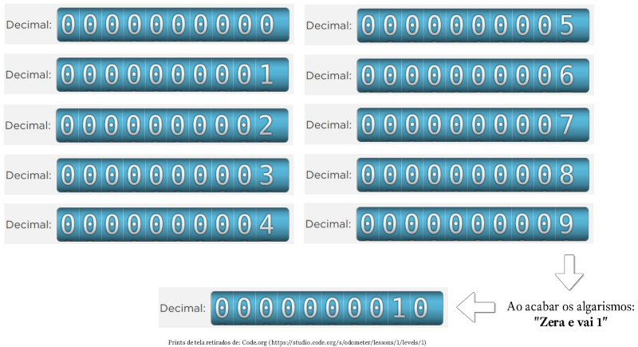

Cada "anel" do hodômetro de um carro tem gravado os dez algarismos, de 0 até 9,
e a marcação da quilometragem percorrida é feita girando o anel. Quando o carro
começa a andar, o anel mais à direita começa a girar, saindo do 0, passando para
o 1, para o 2, e assim sucessivamente, até marcar 9 km. Quando o carro percorre
o próximo quilômetro ocorre uma coisa fundamental no hodômetro: toda vez que
um anel esgota os algarismos ocorre um processo de **zera e vai 1**. Repare que
ao sair de 9 para 10 quilômetros, o anel mais à direita "zerou" e ocorreu um
"vai 1" para o segundo anel, que passou a marcar "1". Esse processo de **zera e
vai 1** é fundamental para entender o hodômetro. Veja como ocorre o processo de
**zera e vai 1** em outras quilometragens:

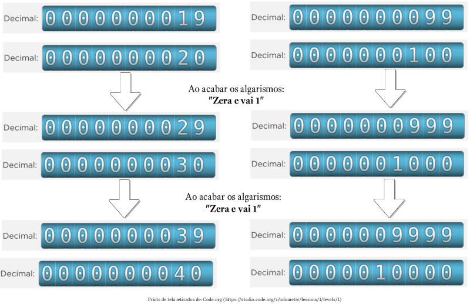

O funcionamento do **sistema binário** funciona exatamente da mesma forma que o
hodômetro decimal, mas agora só temos dois algarismos. Imagine que você tem um
carro com um hodômetro especial, um "hodômetro binário". Veja como esse
hodômetro binário funciona:

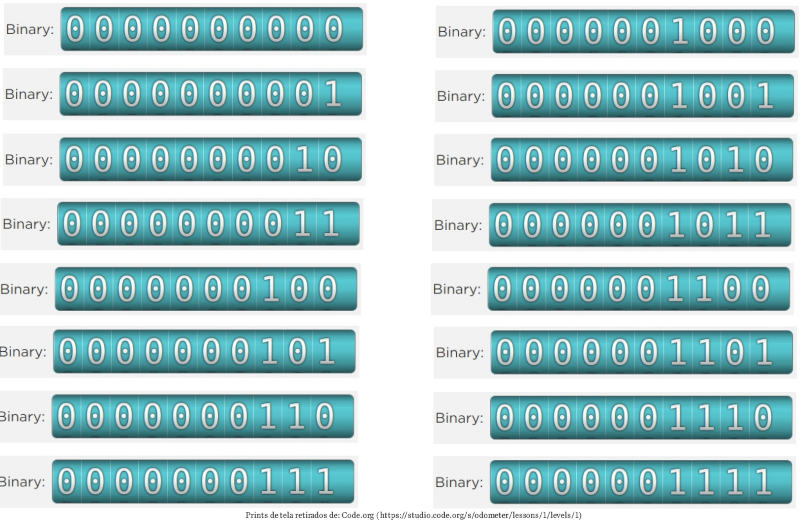

Perceba que o funcionamento do hodômetro binário é exatamente o mesmo do
hodômetro decimal, ou seja, toda vez que os algarismo de um anel se esgotam,
ocorre o processo de **zera e vai 1**. A diferença é que agora só temos dois
algarismos, $$0$$ e $$1$$, e assim o processo de zerar ocorre mais vezes. O
pequeno vídeo abaixo compara os hodômetros decimal e binário, de 0 até 31:

<video width="720" height="208" controls>
  <source src="videos/hodometros.mp4" type="video/mp4">
</video>

Se o hodômetro tem 10 algarismos binários, então podemos representar $$2^{10} =
1024$$ números, de $$0$$ até $$1023$$. Assim, o maior número binário com 10
algarismos é o $$1111111111$$, que corresponde ao decimal $$1023$$.

Outra maneira de entender o funcionamento do sistema binário é utilizar várias
lâmpadas, com a seguinte convenção: se a lâmpada estiver desligada, estará
representando o algarismo $$0$$; se a lâmpada estiver ligada, estará
representando o algarismo $$1$$. Se utilizarmos 5 lâmpadas, então poderemos
representar $$2^5 = 32$$ números, do $$0$$ até o $$31$$. Alguns exemplos estão
nas figuras abaixo.

Se todas as lâmpadas estão apagadas, representam o número 0:

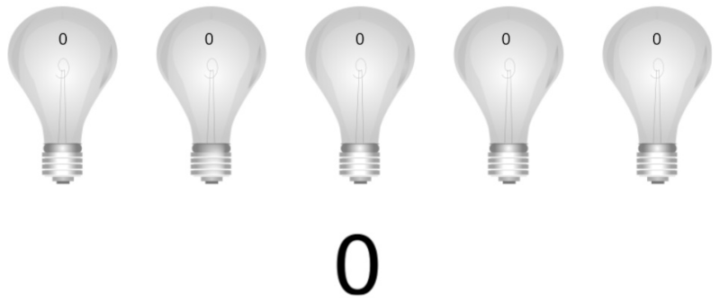

Se a primeira e a terceira (da direita para esquerda) estão acessas, estão
representando o número 5:

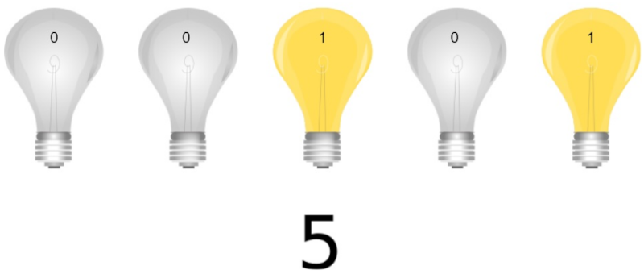

Se a primeira, terceira e quarta (da direita para esquerda) estão acessas, estão
representando o número 13:

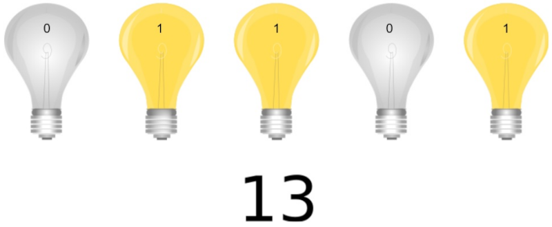

Se a primeira, segunda e quinta (da direita para esquerda) estão acessas, estão
representando o número 19:

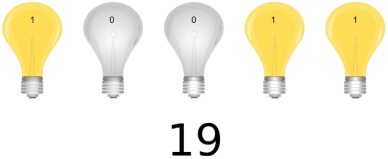

Se a segunda, quarta e quinta (da direita para esquerda) estão acesas, estão
representando o número 26:

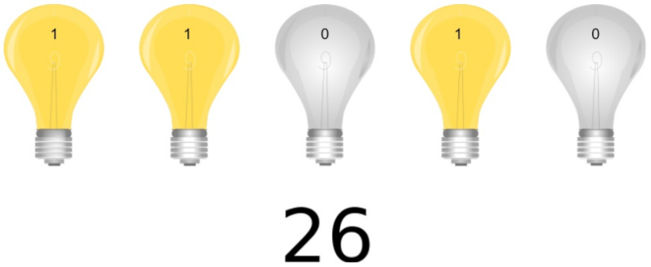

E se todas estão acessas, estão representando o número 31:

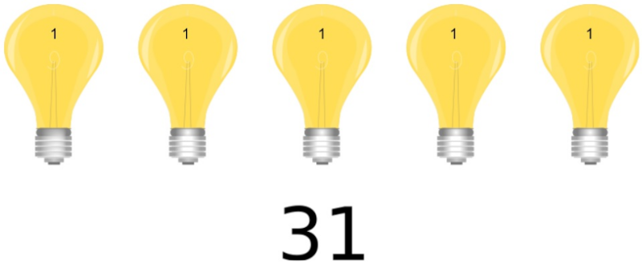


Para saber quantos números é possível representar com $$n$$ dígitos binários,
basta calcular $$2^n$$. Desse total calculado, a faixa numérica vai de $$0$$ até
$$n - 1$$. Por exemplo: com 13 dígitos binários podemos representar $$2^{13}
= 8.192$$ números, do $$0$$ até $$8.191$$.

Cada dígito binário é chamado de **bit**, de *binary digit*.


#### Por que os computadores "falam" binário?
Por conveniência e confiabilidade! É mais fácil projetar circuitos eletrônicos
que representam apenas dois algarismos do que circuitos eletrônicos que
representam dez algarismos. Além disso a representação com dois algarismos é
perfeita para um dispositivo que utiliza eletricidade: se um circuito está com
eletricidade, representa o algarismo $$1$$; se um circuito está sem
eletricidade, representa o algarismo $$0$$.

A idéia de utilizar o sistema binário nos computadores partiu do matemático
húngaro **John von Neumann** que, em 30/06/1945, publicou um documento
intitulado "*First Draft of a Report on the EDVAC*" que sugeria o uso do binário
nos computadores. Na época os computadores utilizavam válvulas a vácuo que
alternavam entre dois estados: permitir ou impedir a passagem de eletricidade.

Atualmente os $$0$$s e os $$1$$s são "fabricados" nos computadores por um
componente eletrônico chamado de **transístor**. O transístor é um dispositivo
que permite ou não a passagem de eletricidade. Quando o transístor está
transmitindo eletricidade, representa o algarismo $$1$$; quando o transístor
está interrompendo a passagem de eletricidade, representa o algarismo $$0$$.

Note o seguinte agora: os $$0$$s e $$1$$s são uma **abstração**, ou seja, os
computadores não entendem o algarismo zero ou o algarismo um. Nós é que
consideramos que um transístor que está permitindo a passagem de eletricidade
está representando o algarismo $$1$$, e nós é que consideramos que um transístor
que não está transmitindo eletricidade está representando o algarismo $$0$$.

E não são apenas os transístores que podem ser utilizados para representar os
algarismo binários. Em tese, qualquer dispositivo eletrônico que tenha dois
estados pode ser utilizados, por exemplo:

* Transístor: utiliza **eletricidade** para representar os algarismos binários;
* CD-ROM: utiliza **sulcos** na superfície para representar os algarismos
  binários;
* Cartão perfurado: utiliza **furos** na superfície para representar os
  algarismos binários;
* Memórias antigas que utilizavam núcleos magnéticos de ferrite: utilizavam a
  **direção do campo magnético** para representar os algarismos binários;
* Hard Disk (HD): utiliza direção do campo magnético para representar os
  algarismo binários;
* Memórias atuais: utilizam transístores (eletricidade) para representar os
  algarismos binários; e
* Fibra óptica: utiliza **luz** para representar os algarismos binários.

Qualquer dispositivo **bi-estável** (com dois estados) pode ser utilizado para
representar os algarismos binários, desde que: a) os estados sejam claramente
distintos entre si; b) os estados possam ser lidos; e c) os estados possam ser
alternados de acordo com nossa necessidade.

#### Formalização dos sistemas numéricos
Agora que você já entendeu a noção intuitiva do sistema binário e já sabe porque
os computadores utilizam esse sistema, precisamos avançar para formalizar de
modo mais matemático a noção de sistema numérico. Para essa formalização os
seguintes conceitos matemáticos serão necessários:

* **Base de um sistema numérico**
* **Valor posicional de um algarismo**
* **Decomposição numérica**

Faremos essa formalização para os sistemas decimal, binário, octal e
hexadecimal, nessa ordem, para facilitar o entendimento.

##### Sistema decimal

Para formalizar o **sistema numérico decimal** vamos, em primeiro lugar, lembrar
o que é a base de um sistema numérico:


A base de um sistema numérico é a quantidade de algarismos utilizados para
representar os números.


Assim, no sistema decimal, a base é $$10$$, pois temos dez algarismos (0, 1, 2,
3, 4, 5, 6, 7, 8 e 9).

A segunda coisa que precisamos nos lembrar é do **valor posicional** de um
algarismo. Por exemplo: no número $$5555$$ temos quatro algarismos "5", mas cada
algarismo tem um valor diferente, dependendo da **posição que o algarismo ocupa
no número**.


No sistema decimal o valor posicional de um algarismo é dado por $$n_i \times
10^i$$, onde:

* $$n$$ é o algarismo considerado;
* $$i$$ é a posição do algarismo no número, sendo que a posição é contada da
  direita para a esquerda e sempre inicia em zero; e
* $$n_i$$ é o algarismo na posição $$i$$.


Tomo como exemplo o número $$347$$. O algarismo $$7$$ está na posição 0, então
seu valor posicional é de $$7 \times 10^0 = 7$$; o algarismo $$4$$ está na
posição 1, então seu valor posicional é de $$4 \times 10^1 = 40$$; e o algarismo
$$3$$ está na posição 2, então seu valor posicional é de $$3 \times 10^2 =
300$$:

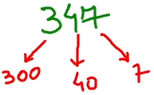

A decomposição numérica do número $$347$$ é, então:


$$\begin{split}
347 &= (3 \times 10^2) + (4 \times 10^1) + (7 \times 10^0)\\
&= (300) + (40) + (7)
\end{split}$$


O número $$5555$$ é formado por algarismos idênticos, mas cada um deles tem um
**valor posicional** diferente:

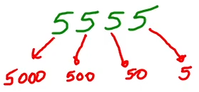

A decomposição numérica do número $$5555$$ é, então:


$$\begin{split}
5555 &= (5 \times 10^3) + (5 \times 10^2) + (5 \times 10^1) + (5 \times 10^0)\\
&= (5000) + (500) + (50) + (5)
\end{split}$$


De modo geral, a **decomposição numérica** no sistema decimal é dada por
(lembre-se de que a posição $$i$$ de um algarismo é contada da direita para
esquerda, iniciando em 0):


$$(n_i \times 10^{i}) + (n_{i-1} \times 10^{i-1}) + (n_{i-2} \times 10^{i-2}) +
\ldots + (n_{0} \times 10^{0})$$


Um exemplo de "quadro de valor posicional" do sistema decimal é mostrado abaixo:

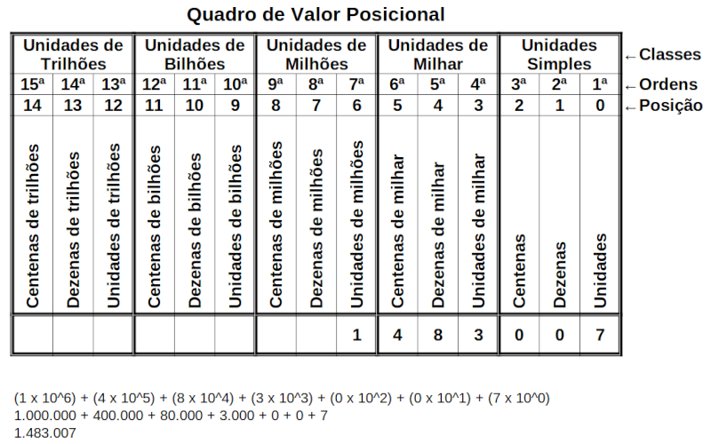

##### Sistema binário
O mesmo raciocínio que utilizamos para o sistema decimal (base, valor posicional
e decomposição numérica) se aplica ao sistema binário. Assim, a **base do
sistema binário** é $$2$$, pois temos dois algarismos para representar os
números (0 e 1).


O valor posicional de um algarismo binário é dado por $$n_i \times 2^i$$, onde:

* $$n$$ é o algarismo considerado;
* $$i$$ é a posição do algarismo no número, sendo que a posição é contada da
  direita para a esquerda e sempre inicia em zero; e
* $$n_i$$ é o algarismo na posição $$i$$.


Considere, como exemplo, o número binário $$10011$$. Para sabermos quanto vale
esse número, basta fazer a decomposição e verificar o valor posicional de cada
algarismo:

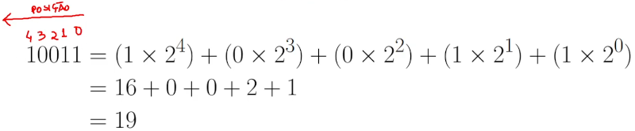

De modo geral, a **decomposição numérica** no sistema binário é dada por
(lembre-se de que a posição $$i$$ de um algarismo é contada da direita para
esquerda, iniciando em 0):


$$(n_i \times 2^{i}) + (n_{i-1} \times 2^{i-1}) + (n_{i-2} \times 2^{i-2}) +
\ldots + (n_{0} \times 2^{0})$$


Um exemplo de "quadro de valor posicional" do sistema binário é mostrado abaixo:

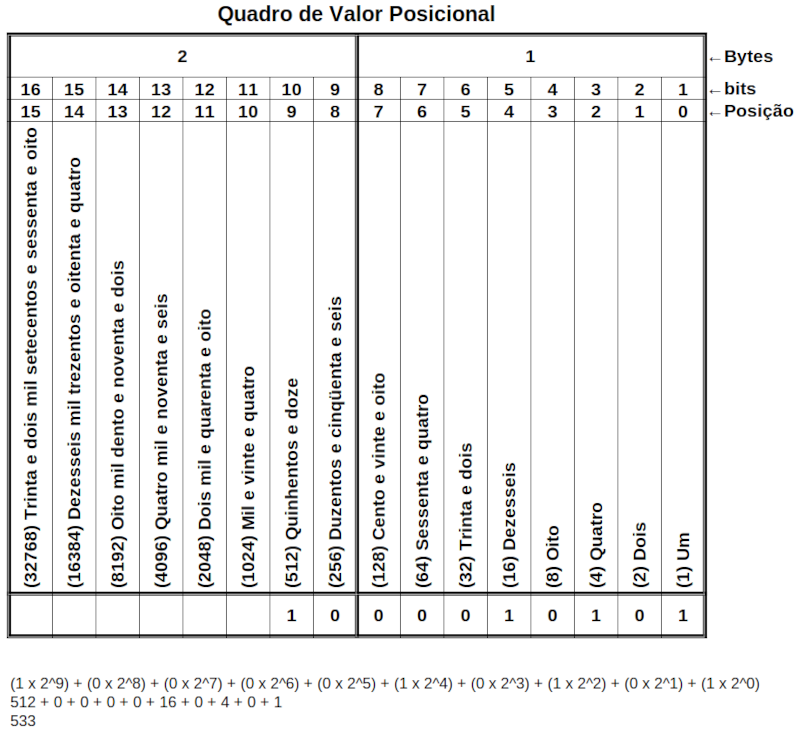

Podemos usar os valores das casas binárias como um "macete" para descobrir
rapidamente o valor decimal de um número binário. Ao invés de fazermos a
decomposição com as posições, escrevemos sobre cada número binário o valor de
sua casa, e somamos os valores das casas que correspondem à algarismos "1", por
exemplo:

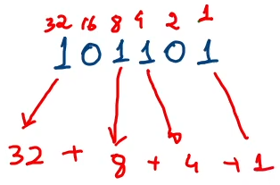


Quando estamos comparando números entre diferentes sistemas, ou quando queremos
indicar o sistema numérico que estamos trabalhando, colocamos a base do sistema
em subscrito, à direita do número. Isso indicará claramente em qual base o
número está. A base pode ser indicada diretamente ou entre parênteses, por
exemplo:

$$10011_{(2)} = 19_{(10)}$$

$$101101_{2} = 45_{10}$$

$$1000010101_{(2)} = 533_{(10)}$$


##### Sistema octal
O sistema numérico octal é pouco utilizado hoje em dia, mas ainda é encontrado
esporadicamente. A **base do sistema octal** é $$8$$, pois tem oito algarismos
para representar os números (0, 1, 2, 3, 4, 5, 6 e 7).


O valor posicional de um algarismo octal é dado por $$n_i \times 8^i$$, onde:

* $$n$$ é o algarismo considerado;
* $$i$$ é a posição do algarismo no número, sendo que a posição é contada da
  direita para a esquerda e sempre inicia em zero; e
* $$n_i$$ é o algarismo na posição $$i$$.


Considere, como exemplo, o número octal $$17034$$. Para sabermos quanto vale
esse número, basta fazer a decomposição e verificar o valor posicional de cada
algarismo:


$$\begin{split}
17034 &= (1 \times 8^4) + (7 \times 8^3) + (0 \times 8^2) + (3 \times 8^1) + (4
\times 8^0)\\
&= (4.096) + (3.584) + (0) + (24) + (4)\\
&= 7.708
\end{split}$$

Assim, podemos dizer que:

$$17.034_8 = 7.708_{10}$$


De modo geral, a **decomposição numérica** no sistema octal é dada por
(lembre-se de que a posição $$i$$ de um algarismo é contada da direita para
esquerda, iniciando em 0):


$$(n_i \times 8^{i}) + (n_{i-1} \times 8^{i-1}) + (n_{i-2} \times 8^{i-2}) +
\ldots + (n_{0} \times 8^{0})$$


Um exemplo de "quadro de valor posicional" do sistema octal é mostrado abaixo:

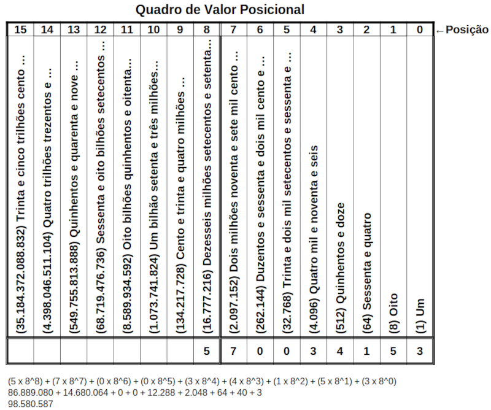

##### Sistema hexadecimal
O sistema hexadecimal é muito, muito utilizado na computação, pois é mais fácil
representar grandes números utilizando o sistema hexadecimal do que utilizando o
sistema binário. Como o uso do sistema hexadecimal é difundido e geral na
computação, você deve ter familiaridade com esse sistema.

A **base do sistema hexadecimal** é $$16$$, ou seja, temos dezesseis algarismos
para representar os números: 0, 1, 2, 3, 4, 5, 6, 7, 8, 9, A, B, C, D, E, F. É
muito importante que você entenda que no sistema hexadecimal as letras de A até
F não são letras, são apenas algarismos que representam os valores de 10
até 15. O quadro abaixo mostra a relação entre os algarismos hexadecimais,
decimais e binários. É extremamente importante que você memorize esse quadro
(com o tempo):

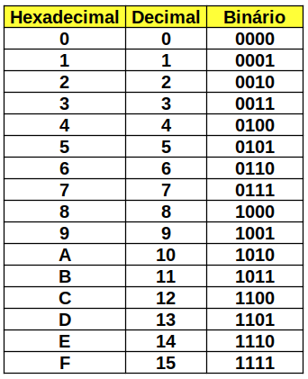


O valor posicional de um algarismo hexadecimal é dado por $$n_i \times 16^i$$,
onde:

* $$n$$ é o algarismo considerado;
* $$i$$ é a posição do algarismo no número, sendo que a posição é contada da
  direita para a esquerda e sempre inicia em zero; e
* $$n_i$$ é o algarismo na posição $$i$$.


Considere, como exemplo, o número hexadecimal $$F90B4$$. Para sabermos quanto
vale esse número, basta fazer a decomposição e verificar o valor posicional de
cada algarismo:


$$\begin{split}
F90B4 &= (15 \times 16^4) + (9 \times 16^3) + (0 \times 16^2) + (11 \times 16^1) + (4
\times 16^0)\\
&= (983.040) + (36.864) + (0) + (176) + (4)\\
&= 1.020.084
\end{split}$$

Assim, podemos dizer que:

$$F90B4_{16} = 1.020.084_{10}$$


De modo geral, a **decomposição numérica** no sistema hexadecimal é dada por
(lembre-se de que a posição $$i$$ de um algarismo é contada da direita para
esquerda, iniciando em 0):


$$(n_i \times 16^{i}) + (n_{i-1} \times 16^{i-1}) + (n_{i-2} \times 16^{i-2}) +
\ldots + (n_{0} \times 16^{0})$$


Um exemplo de "quadro de valor posicional" do sistema octal é mostrado abaixo:

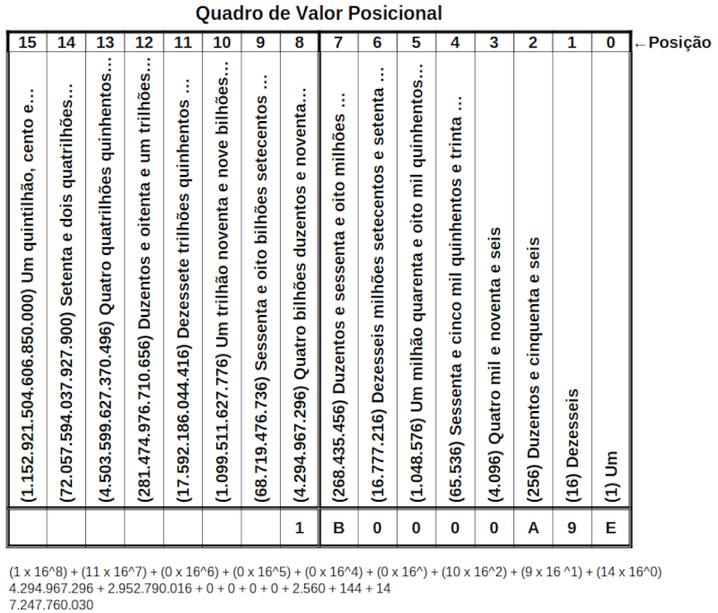

##### Generalização para outros sistemas
O valor de um algarismo em um sistema numérico de base $$b$$ é dado por $$n_i
\times b^i$$. A decomposição numérica é dada por:


$$(n_i \times b^{i}) + (n_{i-1} \times b^{i-1}) + (n_{i-2} \times b^{i-2}) +
\ldots + (n_{0} \times b^{0})$$


#### Unidades de medida decimal
As seguintes unidades de grandezas de base 10, maiores do que a unidade,
padronizadas pelo Sistema Internacional de Unidades, são:

As seguintes unidades de grandezas de base 10, menores do que a unidade,
padronizadas pelo Sistema Internacional de Unidades, são:

 

Resumo das unidades:

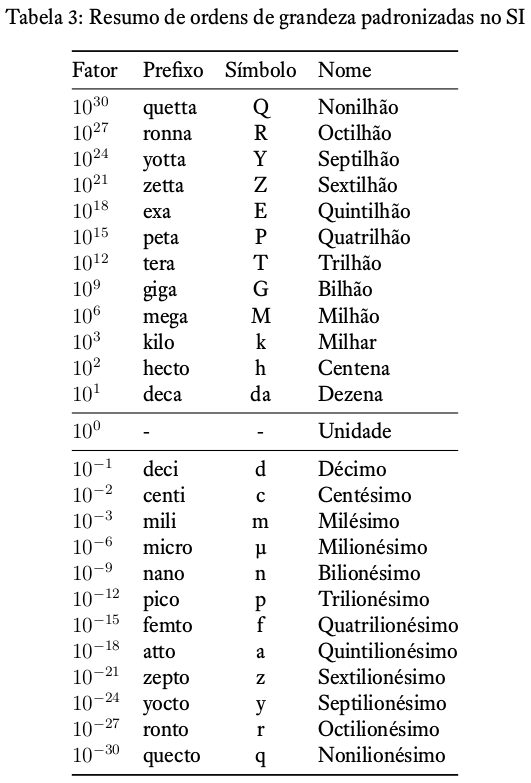

#### Unidades de medida binária
As unidades de medida no sistema binário, levam em consideração que:


* **bit (b)**: um algarismo binário (0 ou 1)
* **nibble**: um conjunto de 4 bits
* **Byte (B)**: um conjunto de 8 bits


O **Byte** (B) é a unidade fundamental de medida na computação pois armazena, em
geral, 1 caractere. Não se esqueça que $$1\,\text{B} = 8\,\text{b}$$, ou
seja, 1 Byte corresponde a 8 bits.

As unidades binárias padronizadas são:

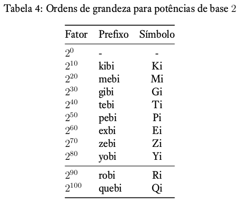

#### Comparação entre medidas decimais e binárias
Os prefixos e símbolos das unidades decimais e binárias são diferentes pois as
unidades não correspondem exatamente entre si. As unidades binárias são sempre
maiores do que as unidades decimais:

### Representação de textos
Como podemos representar textos no computador? Se os computadores só entendem
números binários, como podemos representar um texto como "**Oi!**"? É necessário
fazer um mapeamento entre as letras e os números binários. Esse mapeamento é
chamado de *encoding*.


Encoding é o processo de mapear os caracteres em números binários, permitindo
então que os caracteres sejam armazenados, transmitidos e processados por
computadores.


Um encoding clássico é o **Código Morse**, que faz o mapeamento das letras e
demais caracteres em pontos e traços. Através desse mapeamento foi possível
transmitir mensagens em longas distâncias utilizando-se um telégrafo.

#### ASCII: American Standard Code for Information Interchange
O ASCII foi um dos primeiros encodings padronizados para mapear caracteres e
números binários. Originalmente o ASCII utilizava 7 bits para representar os
caracteres, significando que poderíamos mapear $$2^7 = 128$$ caracteres, na
faixa de $$0$$ até $$127$$. A tabela de mapeamento ASCII original está a seguir:

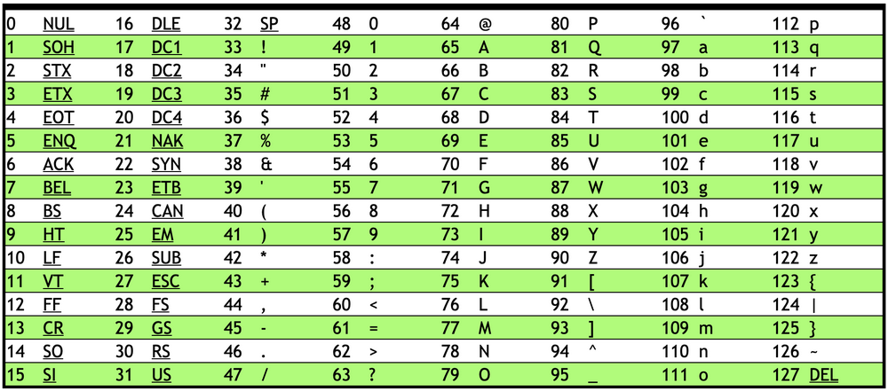

O ASCII tem duas características principais:

* É um encoding **direto**, ou seja, cada letra é mapeada diretamente para uma
  seqüência binária específica, por exemplo: A = 1000001; e
* É um encoding de **tamanho fixo**, ou seja, cada caractere é mapeado com 7
  bits.

Como o ASCII pode mapear apenas 128 caracteres diversos caracteres não têm
representação como, por exemplo, as letras acentuadas.

Para incluir mais alguns caracteres foi criado o *Extended ASCII*, que passou a
utilizar 8 bits para mapear os caracteres. Agora o ASCII poderia mapear $$2^8 =
256$$ caracteres, na faixa de $$0$$ até $$255$$. A tabela *Extended ASCII* está
a seguir:

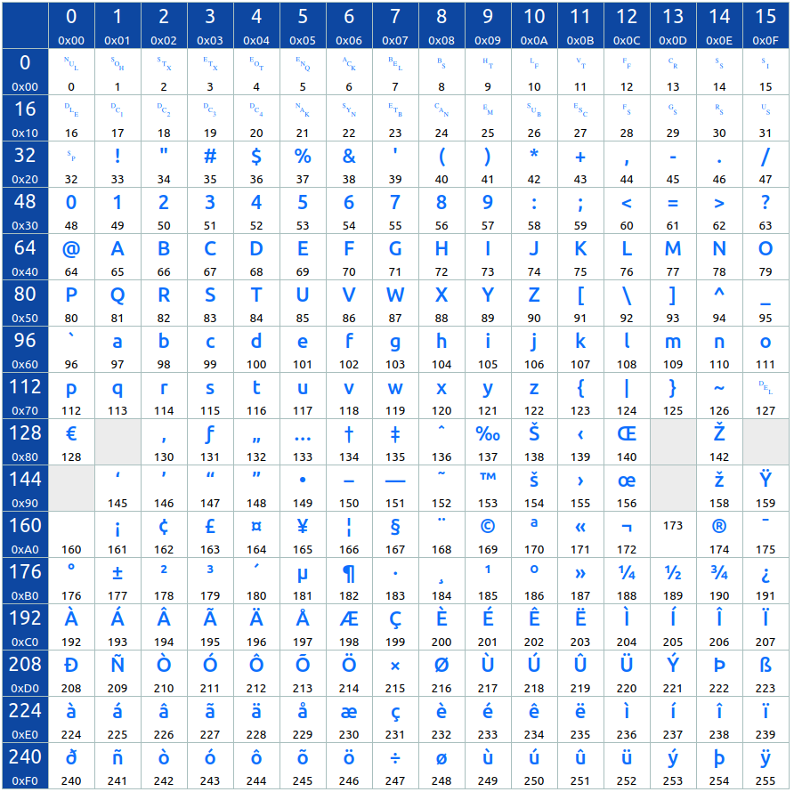

<i class="fa-light fa-download"></i> <i class="fa-light fa-file-pdf"></i>
[Clique aqui para fazer o download de um PDF com a tabela ASCII
detalhada](ascii.pdf)

Entretanto, mesmo com 256 caracteres mapeados, a maioria dos sistemas de escrita
utilizados no mundo não tem representação no ASCII: caracteres cirílicos,
chineses, hieróglifos egípcios, sânscrito e muitos outros. Para superar as
limitações do ASCII foi criado o padrão **Unicode**.

#### Unicode
(em breve)

### Anexo: conteúdo adicional sobre representação de números
Este anexo contém vídeos com conteúdo adicional a respeito da representação de
números, incluindo:

0. Transformações entre sistemas numéricos
0. Representação de números inteiros negativos em binário
0. Representação de números fracionários em binário

#### Transformações entre sistemas numéricos
(em breve)
#### Representação de números inteiros negativos em binário
(em breve)
#### Representação de números fracionários em binário
(em breve)

